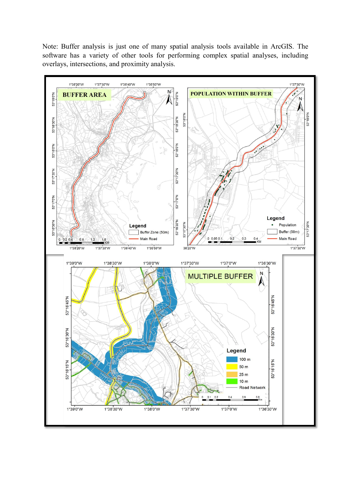

> Reconstructed archive: this material was assembled on 2026-09-29. February 2024 author dates are assigned archival dates, not original work timestamps.

# Reading the archived maps

This is a rendered copy of PDF page 4, preserved with the page's labels and attribution. It illustrates the buffer discussion; it is not a map regenerated from source data.

When assessing the original figures, identify the input feature, the distance or classification represented, the units, the legend, and the study extent. Distinguish the map's visual appearance from a verified calculation. The source layers and processing parameters are unavailable here, so distance accuracy and complete reproducibility remain unverified.

PDF page 6 contains further map examples. Read their labels in the full-resolution report before interpreting a relationship. Do not infer numerical results from a small preview. Third-party basemap or figure rights remain with their respective sources.
